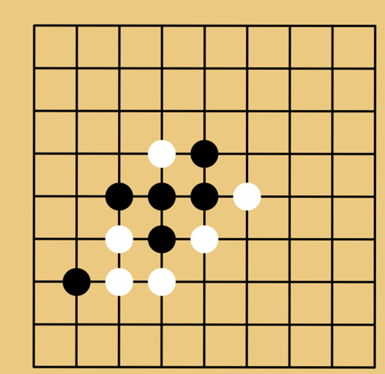

# 五子棋遊戲 AI 專案

## 專案簡介

這是一個基於 C# 開發的五子棋遊戲，包含玩家與電腦對戰的功能。電腦 AI 採用基於評分函數的啟發式算法，能夠根據當前局勢評估每個可能的落子點，並選擇最佳位置下棋。該系統支援自動防守和進攻策略，為玩家提供一個具有挑戰性的遊戲對手。

## 主要功能

1. **玩家 vs 電腦對戰**：玩家可以與電腦 AI 進行五子棋對局。
2. **智能下棋**：電腦 AI 能夠根據棋盤局勢計算最佳下棋點，考慮進攻和防守兩方面的策略。
3. **勝負判斷**：遊戲系統會自動判斷當前局面，當一方形成五子連珠時遊戲結束。
4. **即時評分系統**：AI 會根據棋子排列情況進行評分，並動態選擇得分最高的下棋點。

## 技術架構

### 1. 電腦 AI
- **算法類型**：採用啟發式評分算法，根據棋局中棋子的分佈情況對可能的落子點進行評分，並根據最高分選擇最佳位置。
- **防守與進攻策略**：AI 在計算每個位置分數時，會同時考慮自己和對手的局勢，平衡進攻與防守。
- **評分矩陣**：AI 根據當前棋盤狀態，使用一個 3x6 的分數矩陣來評估每個位置可能形成的棋型並給予對應的分數。

### 2. 視覺化界面
- 使用 **Windows Forms** 提供玩家操作的圖形界面，讓玩家可以輕鬆地在視覺化棋盤上進行對弈。

## 安裝與運行

### 系統需求
- **開發環境**：Visual Studio
- **語言**：C#
- **操作系統**：Windows

### 安裝步驟
1. 使用 Visual Studio 打開專案並進行編譯。
2. 運行應用程式，啟動五子棋遊戲。

### 遊戲操作
- 玩家使用滑鼠在棋盤上點擊對應的節點進行落子。
- 電腦 AI 將自動進行回合，並在棋盤上顯示下棋結果。
- 當某一方形成五子連珠時，遊戲會顯示勝利訊息，並可選擇重新開始遊戲。

## 遊戲規則

1. **基本規則**：雙方輪流在棋盤上空白節點放置棋子，先形成五子連珠者勝。
2. **AI 策略**：
   - 電腦 AI 同時進行防守和進攻，會根據棋局計算出每個可能落子點的分數，並選擇分數最高的點進行下棋。
3. **評分機制**：
   - AI 會基於當前局勢，根據連續棋子數量和空位狀況進行評分，防止玩家形成連續五子，同時嘗試自行形成連子。

## 未來改進

- **多層次算法優化**：加入 Minimax 或 Alpha-Beta 剪枝算法，實現更複雜的多步預測功能。
- **增加難度級別**：根據玩家的需求，提供不同級別的 AI 難度。
- **網絡對戰功能**：實現玩家之間的在線對戰功能。

## 貢獻者

- **作者**：madhu
- **聯絡方式**：qq10455006@gmail.com